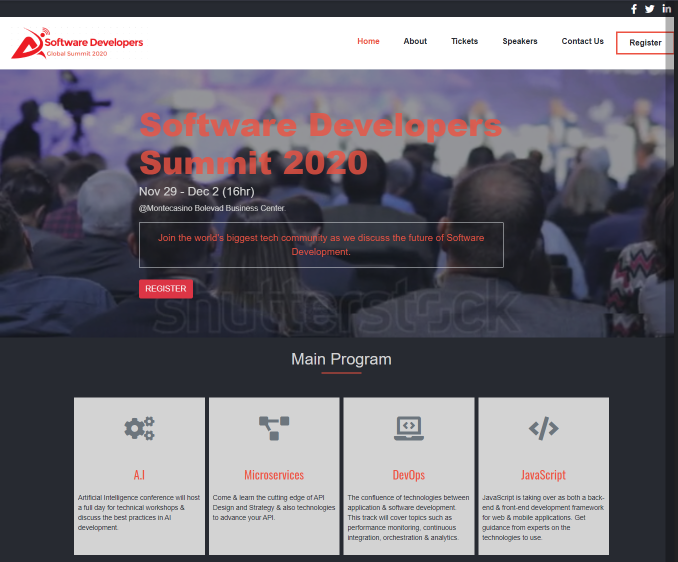

# Software Developers Global Summit 2020
Annual conference for developers around the world.

## Project Design:

This project was developed following the [CC Global Summit 2015](https://www.behance.net/gallery/29845175/CC-Global-Summit-2015) design by [Cindy Shin](https://www.behance.net/adagio07). It is a Microverse capestone project that I developed using bootstrap and a few more technologies (mentioned below). 

Software developers Global Summit 2020 is a conference held at the end of each year. The site consist of three (Home, About, & Tickets) pages which do not have any functionality yet. The goal is to follow the given ([CC Global Summit 2015](https://www.behance.net/gallery/29845175/CC-Global-Summit-2015)) design, & personalise the content to anything relating to conferencing. You can see the project live demo (link provided below). Each of the pages on the site has got the mobile screen version (max-width ==> 768px) & desktop version (min-width ==> 768px).

## Built With

- CSS, HTML
- Sass, Bootstrap 4
- Stylelint validator

## SetUp
To get this project on your machine & contribute to the project, you can run <code>git clone https://github.com/ClaytonSiby/Software-Developers-Summit.git</code> on the command line and create a feature branch to your directory both locally and remotely.

## Tools Used:

- Visual Studio Code

## Live Demo

[Live Demo Link](https://raw.githack.com/ClaytonSiby/Software-Developers-Summit/software-developers-summit/idesign/index.html)

## Author

👤 **Clayton Siby**

- Github: [@Clayton Siby](https://github.com/ClaytonSiby)
- Twitter: [@ClaytonSiby](https://twitter.com/ClaytonSiby)
- Linkedin: [linkedin](https://www.linkedin.com/in/clayton-siby-48a8a0183/)
- claytonsiby@gmail.com

# 🤝 Contributing

Contributions, issues and feature requests are welcome!

Feel free to check the [issues page](https://github.com/ClaytonSiby/Software-Developers-Summit/issues).

## Please show your support

Give a ⭐️ if you like this project!

## Acknowledgments

- Hat tip to [Cindy Shin in Behance](https://www.behance.net/adagio07) 
- StackOverflow
- W3Schools.com
- getbootstrap.com

# 📝 License

This project is [Creative Commons](https://creativecommons.org/licenses/by-nc/4.0/) licensed.
